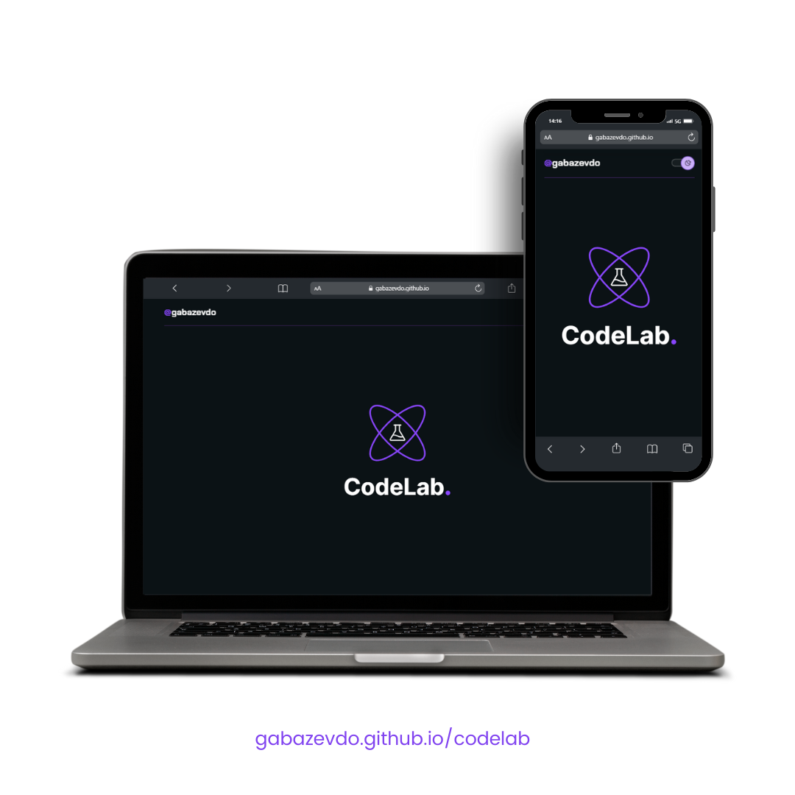



    

 <h2 style="font-size:32px; margin-top: 30px; font-weight: 600;"> O projeto 🎓 </h2>
 

  Neste repositório será postado projetos/desafios frontend, que é open-source e possuí um conjunto de desafios $\color{#8946ff}{\textsf{pela e para}}$  a comunidade de desenvolvimento.

Seu propósito é ajudar os estudantes a praticarem seus conhecimentos em desenvolvimento frontend, abrangendo áreas como HTML, CSS, JavaScript e também bibliotecas como React, Vue e Angular.´

$\color{#8946ff}{\textsf{Toda semana será proposto um novo desafio na comunidade para ser desenvolvido}}$ .

Que por sua vez, poderá ser avaliado por desenvolvedores com maiores senioridades e que são ADM's e organizadores do projeto.

  

 <h2 style="font-size:32px; margin-top: 30px; font-weight: 600;"> Os desafios 👨🏾‍💻</h2>

Você pode acessar todos os desafios já finalizados [clicando neste link](https://gabazevdo.github.io/codelab/).

| ✅ status concluído | ⚠️ em desenvolvimento |
| ------------------- | --------------------- |

| Status | Desafio |    Nome     |
| :----: | :-----: | :---------: |
|   ✅   |   01    |    Blog     |
|   ⚠️   |   02    | JordanShoes |

   

<h2 style="font-size:32px; margin-top: 30px; font-weight: 600;">CodeLab</h2>

Você está convidado a participar e conhecer a comunidade [CodeLab](https://github.com/iuricode/desafios-frontend)

Adquira já o [material do Iuri Code](https://iuricode.com/efront/). São Ebooks de excelente qualidade e aprendizado.
